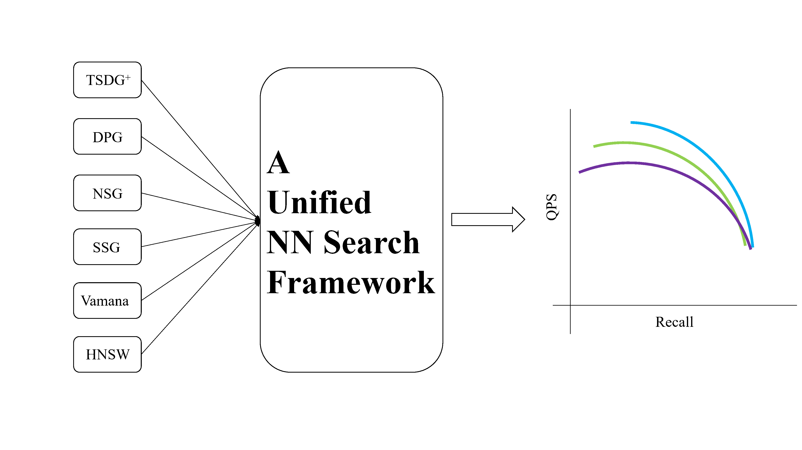
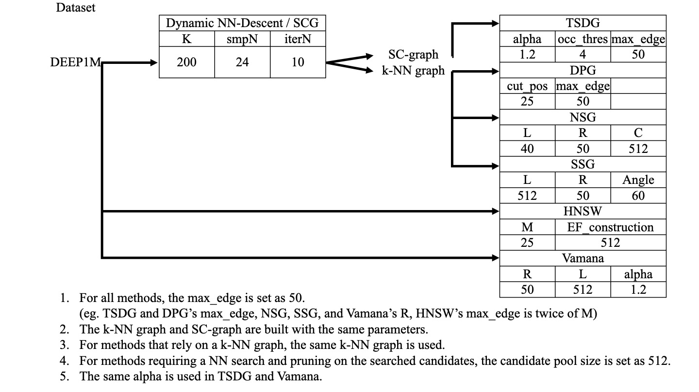
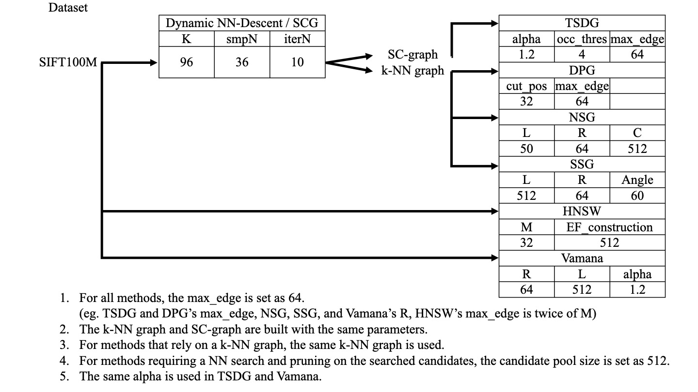
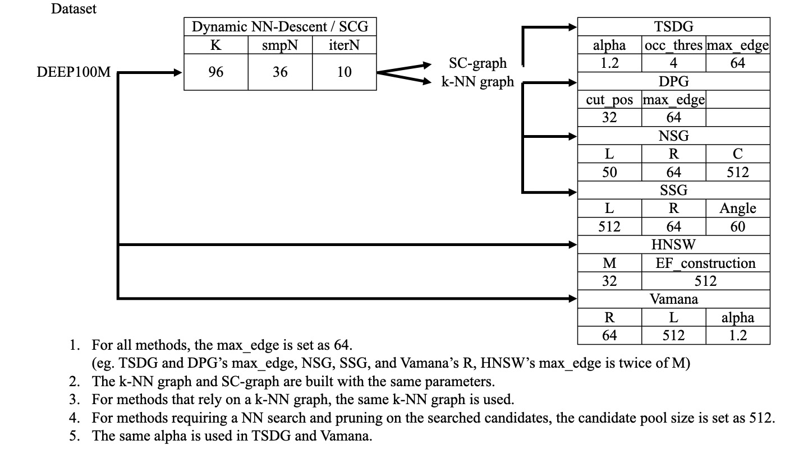
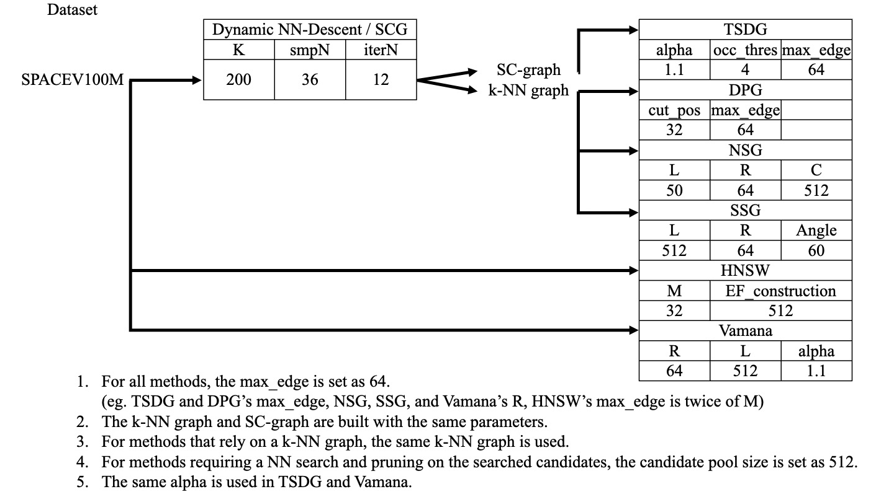

# NNSearch: A Unified NN Search Framework

Due to restrictions imposed by the company's agreement, we are unable to release the internal code for building indexes and conducting the NN search. However, we now release a unified NN search framework based on the [hnswlib](https://github.com/nmslib/hnswlib). One advantage is that it allows for a fairer comparison of search performance with hnswlib, even if the latter employs a hierarchical indexing structure.

## Features



* Support various indexing graphs (TSDG$^+$, DPG, NSG, SSG, Vamana, and HNSW), while only one universal API.
    * Automatically select the load function based on the suffix of the index graph.
    * `.ivecs` for k-NN graph, shortcut graph, TSDG$^+$, and [DPG](https://github.com/DBAIWangGroup/nns_benchmark)
    * `.nsg` for [NSG](https://github.com/ZJULearning/nsg) 
    * `.ssg` for [SSG](https://github.com/ZJULearning/SSG) 
    * `.hnsw` for [HNSW](https://github.com/nmslib/hnswlib)
    * [Vamana](https://github.com/microsoft/DiskANN)'s indexing graph has no suffix. 
* Fast NN search performance and has a fair comparison with hnswlib. 
    * no change to hnsw indexing and NN search. 
    * our NN search = hnsw layer0's NN search + random seeds. 


## Compile 

* Please make sure `Boost` is installed. On ubuntu, it can be installed by `sudo apt install libboost-all-dev`.

```shell
cd hnswlib
mkdir build && cd build 
cmake .. && make -j
cd ../..
```

## Pre-built Indexing Graphs Are Available

* [Google Drive](https://drive.google.com/file/d/1Se5q3aYV5H26u21-uIBh9Lq-qgpSN3mQ/view?usp=sharing)
* Only SIFT1M and DEEP1M have indexing graphs for all comparison methods, while other datasets only have index graphs for TSDG$^+$.

## Usage 
1. Run NN search performance curve
* This will load the indexing graph to run NN search and save records.
> warning: NN search works on single-thread. It may take several minutes.

```shell
./hnswlib/build/uni_nnsearch \
--base_path=/home/jfwang/data/sift1m/sift1m_base.fvecs \
--query_path=/home/jfwang/data/sift1m/sift1m_query.fvecs \
--gt_path=/home/jfwang/data/sift1m/sift1m_gt.ivecs \
--index_path=/home/jfwang/data/sift1m/sift1m_TSDGed_K200_SavMem_XNDesc_SCG_1.2_4_50.ivecs \
>> ./nns_records/sift1m_TSDG_plus.record
```

2. visualization
* after all records are put in the `./nns_records` folder. we can call `draw_fig.py` to show curves.

```shell
python draw_fig.py
```

## Indexing Parameters Are Available
* We release the parameters we used to index.
* LSH-APG's parameters are loyal to the [original implementations](https://github.com/Jacyhust/LSH-APG) except the searched candidate pool size, which is set as `512`. Since it cannot be integrated into this NN search framwork, its parameters are not listed here, and can be found in its literature. 









## Author
Jie-Feng Wang
This project was developped when Mr. Jie-Feng Wang was pursuing his Master degree in Xiamen Unviersity.

## Note
1. Only `float` datatype is supported as hnswlib does. 
2. Only the search performance curves in our paper's Fig 6 - 8 can be made. We have an un-released version code, which optimizes the memory cost during NN search. 
3. For full API, plz run `./hnswlib/build/uni_nnsearch -h` 
4. Our API source codes are listed at `hnswlib/examples/cpp/uni_nnsearch.cpp` and `hnswlib/hnswlib/dataloader.h`. Have fun with it. 
